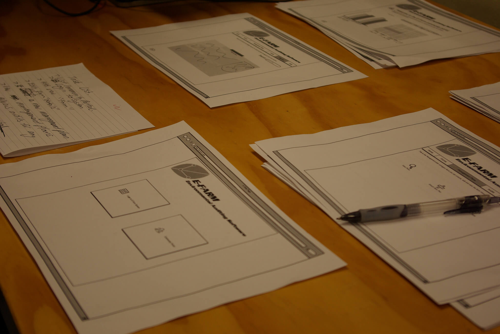

# Week 4 (May 30 - Jun 5)

## Summaries and Questions

[May 30th Class One-minute Summaries](https://sso.canvaslms.com/courses/1924881/assignments/14377745)

## Presented Slides

&lt;iframe src="<a href="https://docs.google.com/presentation/d/e/2PACX-1vRnnRFelgw1ksq_p8Eryg3dnyLCRRLPf5fBgdwdv9p-tCIwcxqWvzDGrGbjxGHL7HqEJVpmV26ntk3a/embed?start=false&amp;loop=false&amp;delayms=3000">https://docs.google.com/presentation/d/e/2PACX-1vRnnRFelgw1ksq_p8Eryg3dnyLCRRLPf5fBgdwdv9p-tCIwcxqWvzDGrGbjxGHL7HqEJVpmV26ntk3a/embed?start=false&amp;loop=false&amp;delayms=3000</a>" frameborder="0" width=780" height="585" allowfullscreen="true" mozallowfullscreen="true" webkitallowfullscreen="true"&gt;

## Supplemental Materials

  <iframe width="780" height="585" src="https://www.youtube.com/embed/MwidSAlbEB8" frameborder="0" allow="accelerometer; autoplay; encrypted-media; gyroscope; picture-in-picture" allowfullscreen="">
</iframe>

## Handouts

[4-UP BROWSERS + GRID](https://sso.canvaslms.com/courses/1924881/files/folder/Handouts/Sketching%20Templates/sneakpeekit-4-browsers) 
[4-UP MOBILES + GRID](https://sso.canvaslms.com/courses/1924881/files/folder/Handouts/Sketching%20Templates/sneakpeekit-4-mobiles)

## Required Reading

[The Skeptic's Guide To Low-Fidelity Prototyping](https://www.smashingmagazine.com/2014/10/the-skeptics-guide-to-low-fidelity-prototyping/)

